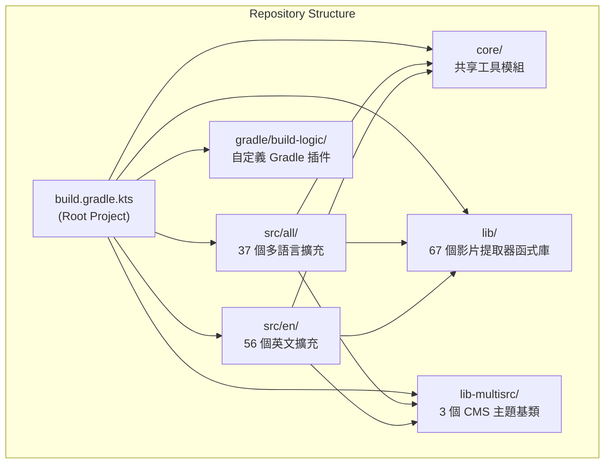
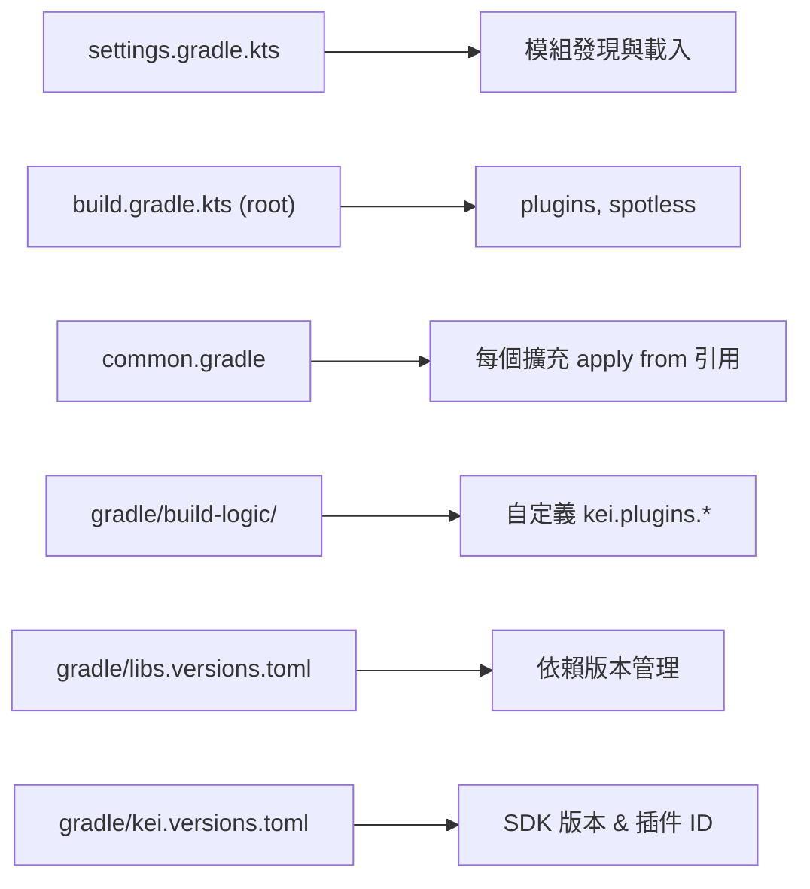
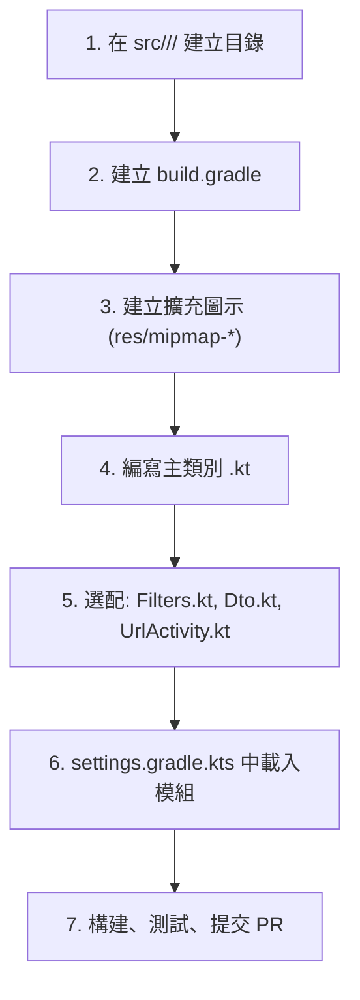
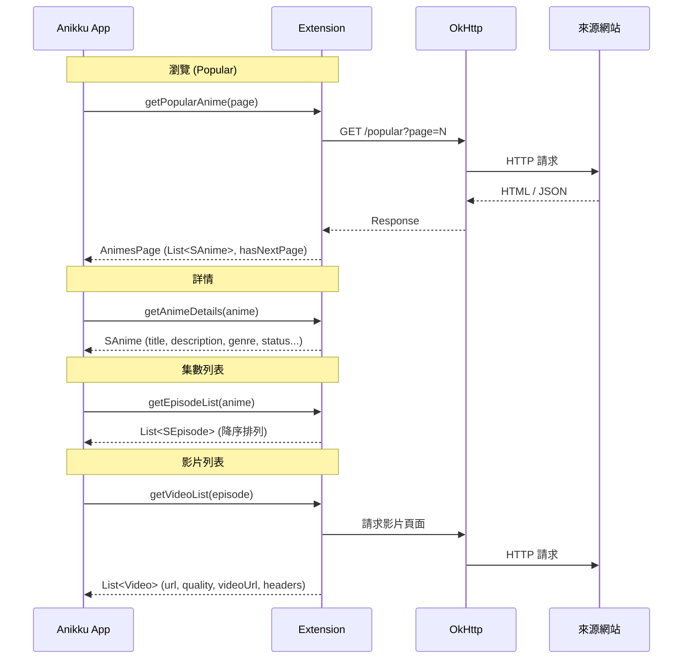

# 📖 sb-extensions-source 開發指南

> **專案性質**：Anikku / AniZen 相容的 Android 動漫串流擴充套件倉庫
> **授權**：Apache License 2.0 | **作者**：salmanbappi
> **技術棧**：Kotlin · Android · Gradle (Groovy + KTS) · OkHttp · Jsoup · kotlinx.serialization

---

## 目錄

- [1. 總覽與架構](#1-總覽與架構)
- [2. 專案目錄結構](#2-專案目錄結構)
- [3. 構建系統詳解](#3-構建系統詳解)
- [4. 擴充套件開發流程](#4-擴充套件開發流程)
- [5. 核心工具庫 (core/utils)](#5-核心工具庫-coreutils)
- [6. 共享函式庫 (lib/)](#6-共享函式庫-lib)
- [7. 多來源主題 (lib-multisrc/)](#7-多來源主題-lib-multisrc)
- [8. 擴充套件呼叫流程](#8-擴充套件呼叫流程)
- [9. 進階功能](#9-進階功能)
- [10. CI/CD 流程](#10-cicd-流程)
- [11. 除錯與測試](#11-除錯與測試)
- [12. 編碼規範與最佳實踐](#12-編碼規範與最佳實踐)
- [13. 提交與 PR 規範](#13-提交與-pr-規範)

---

## 1. 總覽與架構

本倉庫是一個 **Gradle 多模組 monorepo**，用於開發可由 [Anikku](https://github.com/komikku-app/anikku) (AniZen) 應用程式載入的動漫串流擴充套件（APK 外掛）。



### 關鍵概念

| 概念 | 說明 |
|------|------|
| **擴充套件 (Extension)** | 一個獨立的 Android APK 模組，定義如何從特定網站抓取動漫資料和影片串流 |
| **提取器 (Extractor)** | `lib/` 中的可重用函式庫，負責從影片平台（如 GogoStream、FileMoon 等）提取實際的影片 URL |
| **主題 (Theme)** | `lib-multisrc/` 中的抽象基類，供使用相同 CMS 的多個網站繼承使用 |
| **Core Utils** | `core/` 提供的共享工具函式，所有擴充自動可用，無需額外依賴宣告 |

---

## 2. 專案目錄結構

```
sb-extensions-source/
├── build.gradle.kts          # 根專案構建配置
├── settings.gradle.kts       # Gradle 模組載入設定
├── common.gradle             # 所有擴充套件共用的 Android 構建邏輯
├── gradle.properties         # JVM / Gradle 全域設定
├── gradle/
│   ├── libs.versions.toml    # 主版本目錄 (dependencies)
│   ├── kei.versions.toml     # 自定義插件版本目錄
│   ├── build-logic/          # 自定義 Gradle 插件 (kei.plugins.*)
│   └── wrapper/              # Gradle Wrapper
├── core/                     # 核心共享工具模組
│   ├── build.gradle.kts
│   └── src/main/kotlin/
│       ├── extensions/utils/ # 舊版工具 (Source, UrlUtils 等)
│       └── keiyoushi/utils/  # 新版工具 (JSON, Network, Date 等)
├── lib/                      # 67 個影片提取器函式庫
│   ├── filemoon-extractor/
│   ├── gogostream-extractor/
│   ├── megacloud-extractor/
│   ├── playlist-utils/
│   ├── cryptoaes/
│   └── ... (共 67 個)
├── lib-multisrc/             # 多來源主題
│   ├── anikototheme/
│   ├── dooplay/
│   └── jellyfin/
├── src/                      # 擴充套件原始碼
│   ├── all/                  # 37 個多語言擴充
│   │   ├── agnisys/
│   │   ├── seanime/
│   │   └── ...
│   └── en/                   # 56 個英文擴充
│       ├── gogoanime/
│       ├── hianimes/
│       ├── aniwave/
│       └── ...
├── template/                 # README 範本
├── tests/                    # Python 測試腳本
├── .github/
│   ├── workflows/            # CI/CD 工作流
│   │   ├── build_push.yml    # 主構建與發布流程
│   │   └── build_pull_request.yml
│   └── scripts/              # CI 輔助腳本
└── CONTRIBUTING.md           # 上游詳細開發指南
```

---

## 3. 構建系統詳解

### 3.1 Gradle 配置層次



### 3.2 版本目錄 (Version Catalogs)

**`libs` 目錄** ([libs.versions.toml](file:///c:/Users/Supebuff/Documents/extensions/sb-extensions-source/gradle/libs.versions.toml))：

| 依賴 | 版本 | 用途 |
|------|------|------|
| Kotlin | 2.4.20 | 編譯語言 |
| Android Gradle Plugin | 9.3.2 | Android 構建 |
| kotlinx.serialization | 1.7.3 | JSON/Protobuf 序列化 |
| OkHttp | 5.3.2 | HTTP 客戶端 |
| Jsoup | 1.22.1 | HTML 解析 |
| QuickJS | 0.9.2 | JavaScript 執行沙盒 |
| extensions-lib | v17 | Anikku 擴充介面 |
| nanohttpd | 2.3.1 | 內嵌 HTTP 伺服器 |

**`kei` 目錄** ([kei.versions.toml](file:///c:/Users/Supebuff/Documents/extensions/sb-extensions-source/gradle/kei.versions.toml))：

| 插件 ID | 用途 |
|---------|------|
| `kei.plugins.extension.legacy` | 擴充套件構建插件 |
| `kei.plugins.library` | 函式庫模組構建插件 |
| `kei.plugins.multisrc` | 多來源主題構建插件 |
| `kei.plugins.spotless` | 程式碼格式化 |

### 3.3 Android 構建參數

| 參數 | 值 |
|------|-----|
| `compileSdk` | 34 |
| `minSdk` | 24 |
| `targetSdk` | 34 |
| Java / JVM Toolchain | 17 |
| 簽名金鑰 | `signingkey.jks`（環境變數注入） |

### 3.4 模組載入控制

在 [settings.gradle.kts](file:///c:/Users/Supebuff/Documents/extensions/sb-extensions-source/settings.gradle.kts) 中：

```kotlin
// 載入全部擴充（預設）
loadAllIndividualExtensions()

// 只載入單一擴充（開發時推薦）
// loadIndividualExtension("all", "jellyfin")
```

> [!TIP]
> 開發單一擴充時，註解掉 `loadAllIndividualExtensions()` 並取消註解 `loadIndividualExtension()`，可大幅加速構建。

### 3.5 BuildConfig 注入的 API 金鑰

在 [common.gradle](file:///c:/Users/Supebuff/Documents/extensions/sb-extensions-source/common.gradle) 中定義，透過環境變數或 `local.properties` 注入：

| BuildConfig 欄位 | 說明 |
|-------------------|------|
| `MEGACLOUD_API` | MegaCloud 影片提取 API |
| `KISSKH_API` | KissKH API |
| `KISSKH_SUB_API` | KissKH 字幕 API |
| `KAISVA` | Kaisva 服務 |
| `TMDB_API` | TMDB 元資料 API |

---

## 4. 擴充套件開發流程

### 4.1 建立新擴充的步驟



### 4.2 檔案結構

```
src/<lang>/<mysourcename>/
├── AndroidManifest.xml          # 選配（僅 Deep Link 需要）
├── build.gradle                 # 必需
├── res/
│   ├── mipmap-hdpi/ic_launcher.png
│   ├── mipmap-mdpi/ic_launcher.png
│   ├── mipmap-xhdpi/ic_launcher.png
│   ├── mipmap-xxhdpi/ic_launcher.png
│   └── mipmap-xxxhdpi/ic_launcher.png
└── src/eu/kanade/tachiyomi/animeextension/<lang>/<name>/
    ├── <Name>.kt                # 主類別（必需）
    ├── Dto.kt                   # 資料模型（選配）
    ├── Filters.kt               # 篩選器（選配）
    └── UrlActivity.kt           # Deep Link 處理（選配）
```

> [!IMPORTANT]
> - `<lang>` 使用 ISO 639-1 雙字母代碼（如 `en`、`pt`），多語言用 `all`
> - `<name>` 只能包含小寫 ASCII 字母和數字
> - 套件路徑：`eu.kanade.tachiyomi.animeextension.<lang>.<name>`

### 4.3 build.gradle 範例

**獨立擴充**（參考 [GogoAnime build.gradle](file:///c:/Users/Supebuff/Documents/extensions/sb-extensions-source/src/en/gogoanime/build.gradle)）：

```groovy
ext {
    extName = 'Gogoanime'         // 顯示名稱（需羅馬字化）
    extClass = '.Gogoanime'       // 主類別的相對路徑
    extVersionCode = 7            // 版本號（每次修改必須遞增）
    isNsfw = false                // NSFW 標記
}

apply from: "$rootDir/common.gradle"

dependencies {
    implementation(project(':lib:byse-extractor'))
    implementation(project(':lib:playlist-utils'))
    implementation(project(':lib:universal-extractor'))
    implementation(project(':lib:vidmoly-extractor'))
}
```

**使用主題的擴充**：

```groovy
ext {
    extName = 'My Source'
    extClass = '.MySource'
    themePkg = 'dooplay'           // 引用 lib-multisrc 中的主題
    overrideVersionCode = 1        // 注意：使用 overrideVersionCode 而非 extVersionCode
    isNsfw = false
}

apply plugin: "kei.plugins.extension.legacy"
```

### 4.4 主類別範例

```kotlin
package eu.kanade.tachiyomi.animeextension.en.mysource

import eu.kanade.tachiyomi.animesource.model.*
import eu.kanade.tachiyomi.animesource.online.AnimeHttpSource
import eu.kanade.tachiyomi.network.GET

class MySource : AnimeHttpSource() {

    override val name = "MySource"
    override val baseUrl = "https://example.com"
    override val lang = "en"
    override val supportsLatest = true

    // ============================== Popular ===============================
    override fun popularAnimeRequest(page: Int) = GET("$baseUrl/popular?page=$page", headers)
    override fun popularAnimeParse(response: Response): AnimesPage { /* ... */ }

    // ============================== Latest ================================
    override fun latestUpdatesRequest(page: Int) = GET("$baseUrl/latest?page=$page", headers)
    override fun latestUpdatesParse(response: Response): AnimesPage { /* ... */ }

    // =============================== Search ===============================
    override fun searchAnimeRequest(page: Int, query: String, filters: AnimeFilterList) = /* ... */
    override fun searchAnimeParse(response: Response): AnimesPage { /* ... */ }

    // ============================= Details =================================
    override fun animeDetailsParse(response: Response): SAnime { /* ... */ }

    // ============================== Episodes ==============================
    override fun episodeListParse(response: Response): List<SEpisode> { /* ... */ }

    // ============================ Video List ==============================
    override fun videoListParse(response: Response): List<Video> { /* ... */ }

    override fun getFilterList(): AnimeFilterList = AnimeFilterList(/* ... */)
}
```

> [!NOTE]
> 主類別可繼承 `AnimeHttpSource`（推薦）或 `Source()`（本專案的擴充基類）。
> 實作 `AnimeSourceFactory` 可在單一套件中暴露多個來源。

---

## 5. 核心工具庫 (core/utils)

位於 [core/src/main/kotlin/](file:///c:/Users/Supebuff/Documents/extensions/sb-extensions-source/core/src/main/kotlin)，所有擴充自動可用，無需額外依賴。

### 5.1 keiyoushi.utils 套件

| 工具模組 | 主要功能 |
|----------|----------|
| `Json.kt` | `parseAs<T>()`、`toJsonString()`、`toJsonRequestBody()` |
| `Protobuf.kt` | `parseAsProto<T>()`、`toRequestBodyProto()` |
| `Date.kt` | `SimpleDateFormat.tryParse()` |
| `Collections.kt` | `firstInstance<T>()`、`firstInstanceOrNull<T>()` |
| `Network.kt` | 網路相關工具 |
| `NextJs.kt` | `extractNextJs<T>()`、`extractNextJsRsc<T>()` |
| `UrlUtils.kt` | `setUrlWithoutDomain()` + `absUrl()` |
| `Preferences.kt` | `getPreferences()`、`getPreferencesLazy()` |
| `GraphQL.kt` | GraphQL 查詢工具 |
| `Crypto.kt` | 加密/解密工具 |
| `Format.kt` | 格式化工具 |
| `AnimeHttpHosterSource.kt` | Hoster 模式來源基類 |

### 5.2 extensions.utils 套件（舊版）

| 工具 | 說明 |
|------|------|
| `Source.kt` | 擴充基類 |
| `UrlUtils.kt` | URL 工具 |
| `Collections.kt` | 集合工具 |
| `WebViewFetcher.kt` | WebView 資料抓取 |
| `EpisodeMetadataFetcher.kt` | 集數元資料 |

### 5.3 常用模式

**JSON 解析**：
```kotlin
import keiyoushi.utils.parseAs

val dto = response.parseAs<MyDto>()                    // 從 Response
val dto = jsonString.parseAs<MyDto>()                  // 從 String
val dto = response.parseAs<MyDto> { it.substringAfter("callback(").dropLast(1) }  // 帶轉換
```

**日期解析**：
```kotlin
import keiyoushi.utils.tryParse

private val dateFormat = SimpleDateFormat("yyyy-MM-dd", Locale.ROOT).apply {
    timeZone = TimeZone.getTimeZone("UTC")
}
episode.date_upload = dateFormat.tryParse(dateStr)  // 失敗回傳 0L
```

**DTO 定義**（正確方式）：
```kotlin
@Serializable
class MyDto(
    @SerialName("anime_id") private val animeId: Int,
    @SerialName("cover_img") private val coverImg: String,
    private val title: String,  // JSON key 相同則不需 @SerialName
) {
    fun toSAnime() = SAnime.create().apply {
        url = animeId.toString()
        thumbnail_url = coverImg
        this.title = title
    }
}
```

---

## 6. 共享函式庫 (lib/)

共 **67 個** 影片提取器和工具函式庫。完整狀態見 [EXTRACTOR_HEALTH.md](file:///c:/Users/Supebuff/Documents/extensions/sb-extensions-source/EXTRACTOR_HEALTH.md)。

### 6.1 常用函式庫

| 函式庫 | 用途 |
|--------|------|
| `playlist-utils` | HLS/M3U8 播放列表解析 |
| `megacloud-extractor` | MegaCloud 影片提取 |
| `gogostream-extractor` | GogoStream 影片提取 |
| `filemoon-extractor` | FileMoon 影片提取 |
| `streamwish-extractor` | StreamWish 影片提取 |
| `cryptoaes` | AES-CBC 解密 / JSFuck 反混淆 |
| `unpacker` | Dean Edwards 打包 JS 解壓 |
| `synchrony` | JS 反混淆 (QuickJS 沙盒) |
| `universal-extractor` | 通用影片提取器 |
| `cloudflare-interceptor` | Cloudflare 攔截處理 |
| `i18n` | 國際化 (.properties) |
| `m3u8server` | 內嵌 M3U8 伺服器 |

### 6.2 使用方式

在擴充的 `build.gradle` 中宣告：
```groovy
dependencies {
    implementation(project(':lib:filemoon-extractor'))
    implementation(project(':lib:playlist-utils'))
}
```

### 6.3 建立新函式庫

```
lib/<mylibname>/
├── build.gradle.kts
└── src/
    └── keiyoushi/lib/<mylibname>/
        └── MyLib.kt
```

`build.gradle.kts`：
```kotlin
plugins {
    alias(kei.plugins.library)
}
// 可選依賴
dependencies {
    implementation(project(":lib:<other-lib>"))
}
```

套件名稱使用 `keiyoushi.lib.<name>` 或 `aniyomi.lib.<name>`（影片提取器）。

---

## 7. 多來源主題 (lib-multisrc/)

目前有 **3 個主題**：

| 主題 | 說明 |
|------|------|
| `anikototheme` | Anikoto 類型網站 |
| `dooplay` | DooPlay CMS |
| `jellyfin` | Jellyfin 媒體伺服器 |

### 主題結構

```
lib-multisrc/<theme>/
├── build.gradle.kts           # 使用 kei.plugins.multisrc + baseVersionCode
└── src/main/java/eu/kanade/tachiyomi/multisrc/<theme>/
    └── <Theme>.kt             # abstract class 繼承 AnimeHttpSource
```

### 使用主題

```groovy
ext {
    extName = 'My Site'
    extClass = '.MySite'
    themePkg = 'dooplay'
    overrideVersionCode = 1     // 最終版本 = baseVersionCode + overrideVersionCode
    isNsfw = false
}
apply plugin: "kei.plugins.extension.legacy"
```

---

## 8. 擴充套件呼叫流程



### 關鍵資料模型

| 模型 | 必要欄位 | 說明 |
|------|----------|------|
| `SAnime` | `url`, `title` | `thumbnail_url` 強烈建議設定 |
| `SEpisode` | `name` | `date_upload` 為 UNIX 毫秒時間戳 |
| `Video` | `url`, `quality`, `videoUrl` | 可附帶自訂 headers |
| `AnimesPage` | `animes`, `hasNextPage` | 分頁控制 |

---

## 9. 進階功能

### 9.1 可設定來源 (Preferences)

實作 `ConfigurableAnimeSource` 介面：

```kotlin
class MySource : AnimeHttpSource(), ConfigurableAnimeSource {
    private val preferences by getPreferencesLazy()

    override fun setupPreferenceScreen(screen: PreferenceScreen) {
        // 使用 keiyoushi.utils 的 addListPreference / addSetPreference 工具
    }
}
```

### 9.2 URL Intent Filter (Deep Link)

需要兩個檔案：
1. `AndroidManifest.xml` — 在擴充根目錄
2. `UrlActivity.kt` — 在原始碼套件中

然後在 `getSearchAnime` 中處理 URL 查詢。

### 9.3 更新策略

```kotlin
anime.update_strategy = UpdateStrategy.ONLY_FETCH_ONCE  // 單集/完結作品
```

### 9.4 來源重命名（保留 ID）

```kotlin
override val id: Long = 1234567890L  // 從 index.json 取得舊 ID
```

---

## 10. CI/CD 流程

```mermaid
flowchart LR
    A["Push to master"] --> B["Prepare Job"]
    B --> C["偵測 lib/ 變更<br/>自動 bump 版本"]
    C --> D["Spotless 格式化"]
    D --> E["產生構建矩陣"]
    E --> F["Build Jobs (並行)<br/>chunk size: 128"]
    F --> G["上傳 APK Artifacts"]
    G --> H["Publish Job"]
    H --> I["合併到 extensions-repo"]
    I --> J["推送到 main + repo 分支"]
    J --> K["清除 jsDelivr 快取"]
    K --> L["建立 GitHub Release"]
```



### 工作流檔案

| 檔案 | 觸發條件 | 用途 |
|------|----------|------|
| [build_push.yml](file:///c:/Users/Supebuff/Documents/extensions/sb-extensions-source/.github/workflows/build_push.yml) | push to master | 主構建、發布到 repo |
| `build_pull_request.yml` | PR | PR 驗證構建 |
| `auto-maintain.yml` | 排程 | 自動維護 |
| `issue_moderator.yml` | Issues | Issue 自動處理 |

### CI 輔助腳本

| 腳本 | 用途 |
|------|------|
| `bump-versions.py` | lib 變更時自動遞增依賴擴充的版本號 |
| `generate-build-matrices.py` | 偵測變更並產生並行構建矩陣 |
| `move-built-apks.py` | 收集構建產出的 APK |
| `create-repo.py` | 產生擴充倉庫索引 (`index.min.json`) |
| `merge-repo.py` | 合併新 APK 到發布倉庫 |
| `Inspector.jar` | 解析 APK 元資料 |

### 發布目標

- **倉庫 URL**：`https://raw.githubusercontent.com/salmanbappi/extensions-repo/main/index.min.json`
- **APK 存放**：`salmanbappi/extensions-repo` 的 `repo` 分支

---

## 11. 除錯與測試

### 11.1 本地執行

在 Android Studio Run Configuration 中設定 Launch Flags：
```bash
# Anikku Dev
-W -S -n app.anikku.dev/eu.kanade.tachiyomi.ui.main.MainActivity -a eu.kanade.tachiyomi.SHOW_CATALOGUES
```

> [!IMPORTANT]
> Android 11+ 必須啟用 `Always install with package manager` 選項。

### 11.2 日誌除錯

1. 在 App 中啟用 **More → Settings → Advanced → Verbose logging**
2. 在 Android Studio Logcat 中過濾 `OkHttpClient` 標籤

### 11.3 網路抓包

使用 `mitmproxy` + OkHttp Proxy 設定：
```kotlin
override val client = network.client.newBuilder()
    .ignoreAllSSLErrors()
    .proxy(Proxy(Proxy.Type.HTTP, InetSocketAddress("10.0.2.2", 8080)))
    .build()
```

### 11.4 命令列構建

```bash
./gradlew src:<lang>:<source>:assembleDebug
```

---

## 12. 編碼規範與最佳實踐

### HTTP / OkHttp

| 規則 | 說明 |
|------|------|
| ✅ 永遠傳 `headers` | `GET(url, headers)` — 否則缺少 User-Agent |
| ✅ Referer 尾斜線 | `.add("Referer", "$baseUrl/")` |
| ✅ 用 `network.client` | 不要用已棄用的 `network.cloudflareClient` |
| ✅ 用 `rateLimitHost` | 代替 `Thread.sleep()` |
| ❌ 不要硬編碼 User-Agent | 除非繞過保護必需 |
| ❌ 不要在 parse 中執行同步請求 | 用對應的 request 方法 |
| ❌ 不要手動設定 Cookie | 用 `lib-cookieinterceptor` |

### JSON / 序列化

| 規則 | 說明 |
|------|------|
| ✅ 用 `parseAs<T>()` | 不要手動 `response.body.string()` |
| ✅ 用 `@Serializable class` | 不要用 `data class`（減少 bytecode） |
| ✅ 用 camelCase + `@SerialName` | 僅在 JSON key 不匹配時使用 `@SerialName` |
| ✅ 用 `toJsonRequestBody()` | 不要手動 `buildJsonObject` |
| ❌ 不要建立 `private val json: Json` | 除非需要自訂配置 |

### HTML 解析

| 規則 | 說明 |
|------|------|
| ✅ 用 `response.asJsoup()` | 不要 `Jsoup.parse(response.body.string())` |
| ✅ 用 `element.absUrl("href")` | 不要手動拼接 URL |
| ✅ 用穩定的 CSS 選擇器 | 避免依賴自動生成的 class 名 |
| ✅ 用 `.ownText()` | 避免 `.select().remove()` 方式 |

### 一般規範

| 規則 | 說明 |
|------|------|
| ✅ Regex 定義在 class 層級 | 避免每次呼叫重新編譯 |
| ✅ SimpleDateFormat 定義為 class 常數 | 建立開銷大 |
| ✅ 用 `buildString {}` | 代替 `StringBuilder()` |
| ✅ 回傳 `emptyList()` 而非拋例外 | 讓 App 顯示本地化錯誤 |
| ❌ 不要加冗餘註解 | 保持程式碼自文檔化 |
| ❌ 不要加語言後綴到 `name` | App 已按語言分組 |

---

## 13. 提交與 PR 規範

### PR 檢查清單

- [ ] 已更新 `extVersionCode`（獨立擴充）或 `overrideVersionCode`/`baseVersionCode`（多來源）
- [ ] 已在 PR 本文引用相關 Issue（如 `Closes #xyz`）
- [ ] 已正確設定 `isNsfw` 標記
- [ ] 未變更來源名稱（或已顯式保留 `id`）
- [ ] 已透過 Android Studio 編譯並測試
- [ ] 已移除 `web_hi_res_512.png`（新擴充）
- [ ] 擴充圖示使用圓角方形格式（Icon Generator 產生）

### Git 工作流建議

```bash
# 部分 clone（推薦，節省空間）
git clone --filter=blob:none --sparse <fork-url>
cd sb-extensions-source/

# Sparse checkout 只載入需要的來源
git sparse-checkout set --cone --sparse-index
git sparse-checkout add common core gradle lib lib-multisrc
git sparse-checkout add src/en/mysource

# 建立功能分支
git checkout -b feat/add-mysource

# 開發、測試、提交
git add .
git commit -m "Add MySource extension"
git push origin feat/add-mysource
```

---

## 附錄：擴充套件統計

| 分類 | 數量 |
|------|------|
| 多語言擴充 (`src/all/`) | 37 |
| 英文擴充 (`src/en/`) | 56 |
| 影片提取器函式庫 (`lib/`) | 67 |
| 多來源主題 (`lib-multisrc/`) | 3 |
| CI/CD 工作流 | 7 |
| **總擴充數** | **93** |

---

> [!NOTE]
> 本文件基於倉庫原始碼和 [CONTRIBUTING.md](file:///c:/Users/Supebuff/Documents/extensions/sb-extensions-source/CONTRIBUTING.md) 整理而成。
> 最新資訊請以倉庫原始碼為準。
